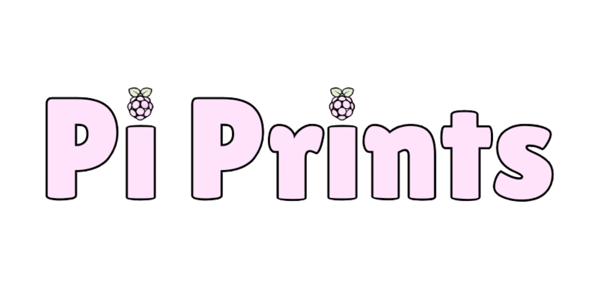
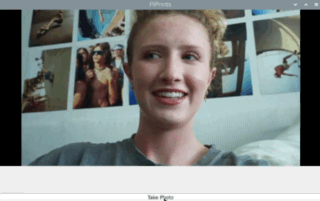
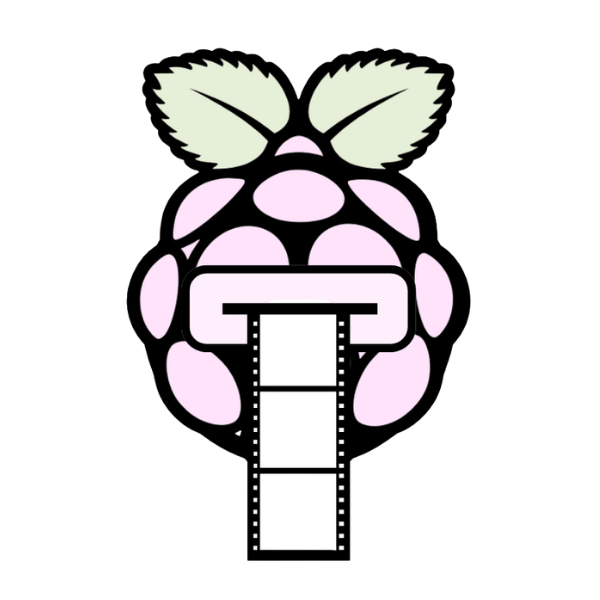

# PiPrints

<p align="center">
  
</p>

<p align="center">
  
</p>

<p align="center">
  <strong>Raspberry Pi-first photo booth platform.</strong>
</p>

<p align="center">
  
</p>

<p align="center">
  
  
  
  
</p>

## Current alpha scope

PiPrints currently runs on Raspberry Pi OS with a Raspberry Pi Camera Module 3.
It provides a PySide6 live preview and a multi-photo booth flow:

```text
Choose layout → choose theme → live preview → countdown → capture → session progress → final layout review → retake
```

Captured runtime images are written to the ignored `captures/` directory. This
alpha includes four-photo grid and classic strip composition. When a completed
session is finalized by the application, its final layout is saved as a PNG in
`photos/YYYY-MM-DD/` under the working directory. It does not yet implement
printing, theme rendering or branding, sharing, GPIO input, or video recording.

## Quick start

On a supported Raspberry Pi OS installation with the camera connected:

```bash
git clone <repository-url>
cd piprints
./scripts/install.sh
./scripts/run.sh
```

See the [development setup guide](docs/development/setup.md) for prerequisites
and troubleshooting, and the [camera guide](docs/hardware/camera.md) for
hardware validation.

## Architecture

PiPrints keeps camera hardware behavior inside `piprints.camera`. The UI and
booth workflow use PiPrints-owned abstractions rather than Picamera2 directly;
`bootstrap.py` creates and injects the concrete objects at startup.

Read the [architecture overview](docs/architecture/overview.md) for the
implemented dependency graph, workflow, package responsibilities, and design
rules.

## Documentation

- [Architecture overview](docs/architecture/overview.md)
- [Architecture decisions](docs/architecture/decisions/README.md)
- [Development setup](docs/development/setup.md)
- [Testing guide](docs/development/testing.md)
- [Raspberry Pi camera guide](docs/hardware/camera.md)
- [Contributing guide](CONTRIBUTING.md)

## License

PiPrints is licensed under the [MIT License](LICENSE).
