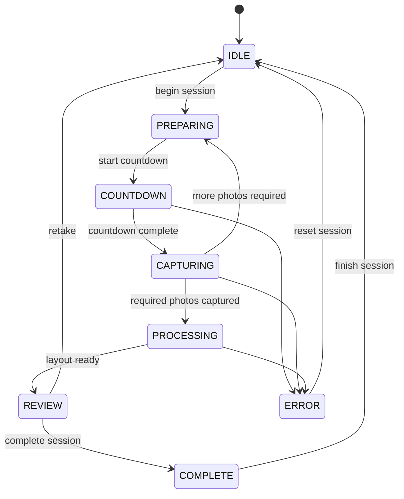
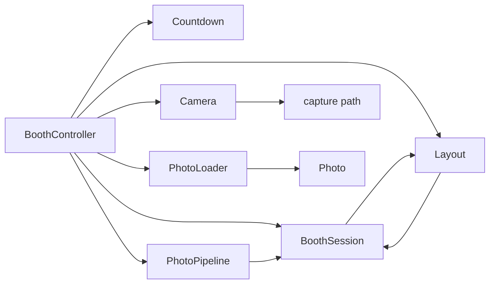
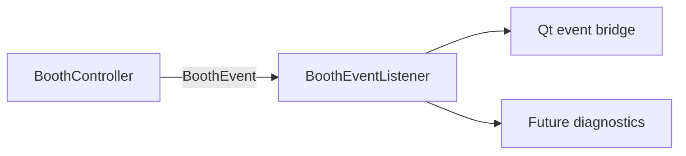

# Booth lifecycle

## Purpose

The booth workflow coordinates one in-memory photo booth interaction without
coupling application logic to PySide6, Picamera2, a printer, or persistence.
`BoothController` owns lifecycle transitions and one active `BoothSession`.

## States and transition ownership

`BoothState` represents the controller's current lifecycle state. The
controller validates every transition in one explicit transition map; UI code
only requests controller operations and renders the resulting events.

The controller supports layouts with any positive `required_photos` value.
After a non-final capture it returns to `PREPARING`, preserving the active
session, so multi-photo layouts do not require layout-specific workflow
branches.

## Session and component responsibilities

`BoothSession` owns its ID, ordered processed capture photos, progress, and the
final `Photo`. The controller orchestrates collaborators but does not decode
images, transform pixels, compose layouts, control camera hardware, or wait on
time itself. `Countdown` owns timing; camera implementations own hardware; the
imaging collaborators own image work.

## Event flow

The controller emits state-change events, session starts/completion, countdown
ticks, captured photos, review readiness, and errors. Listeners are registered
per controller, never globally. Listener exceptions are logged and ignored so
observation cannot corrupt the workflow.

## Failure and reset

Camera, load, pipeline, layout, and countdown failures transition the
controller to `ERROR`, publish an `ERROR` event, and clear the active session.
Capture and processing failures preserve the original exception as the cause of
the raised `BoothCaptureError`. `reset_session()` is the explicit `ERROR →
IDLE` recovery operation. A successful reviewed session follows
`complete_session()` then `finish_session()`; `retake()` discards a reviewed
session directly to `IDLE`.
