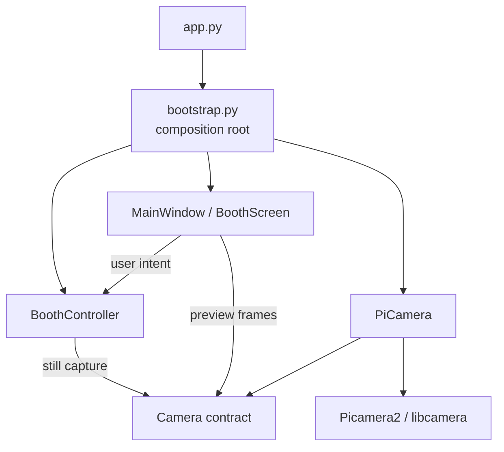
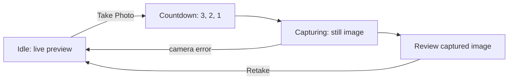

# Architecture overview

## Purpose

PiPrints is a Raspberry Pi-first photo booth platform. Its current design
prioritizes high cohesion, low coupling, dependency inversion, composition over
inheritance, testability, and hardware isolation. The codebase grows in small
milestones so new hardware and workflow capabilities can be added without
turning the application into a hardware-specific UI.

## Current implementation

The alpha implements application startup, a basic booth workflow, Raspberry Pi
camera control, and a PySide6 interface. `app.py` starts the application and
owns process-level camera cleanup. `bootstrap.py` is the composition root: it
creates `PiCamera`, `BoothController`, and `MainWindow`, then injects the
dependencies they need.

`BoothController` owns the workflow state (`IDLE`, `COUNTDOWN`, `CAPTURING`,
and `REVIEW`) and requests still captures through the `Camera` contract.
`PiCamera` adapts Picamera2 and libcamera behind that contract. It configures
continuous autofocus for Camera Module 3, supplies standard `PreviewFrame`
values for live preview, and switches to a still configuration for capture.

The UI uses PySide6. `BoothScreen` renders the countdown, review, and retake
controls. `CameraPreviewWidget` obtains `PreviewFrame` values on a worker
thread, retains only the latest frame, and paints it from a Qt timer. The still
capture is also performed by a short-lived Qt worker so the UI thread remains
responsive.



The UI depends directly on the PiPrints-owned camera contract only for preview
frames. Workflow commands travel through `BoothController`; neither path gives
the UI a Picamera2 or libcamera object.

## Current capture workflow



The preview worker stops before the still capture begins. Picamera2 restores
the preview configuration after the still capture, and the preview worker is
started again when the user selects **Retake**. Captures currently go to the
runtime `captures/` directory; this is not a storage or session subsystem.

## Package responsibilities

| Package | Current responsibility |
| --- | --- |
| `booth` | Implemented: basic capture state and camera coordination. |
| `camera` | Implemented: `Camera` contract, `PreviewFrame`, domain errors, and Picamera2 adapter. |
| `config` | Placeholder for future runtime configuration. |
| `imaging` | Placeholder for future image operations and layouts. |
| `input` | Placeholder for future user and hardware input integration. |
| `printing` | Placeholder for future printer abstractions and implementations. |
| `session` | Placeholder for future session lifecycle behavior. |
| `storage` | Placeholder for persistent captured-photo storage; not used by current runtime captures. |
| `themes` | Placeholder for future UI theming. |
| `ui` | Implemented: PySide6 preview, booth screen, and top-level window. |
| `utils` | Placeholder; no shared utility behavior is implemented yet. |

## Dependency rules

- UI code must not import Picamera2 or libcamera.
- Picamera2/libcamera behavior belongs in `piprints.camera`.
- Booth logic must not know PySide6 widget details.
- `bootstrap.py` may depend on concrete implementations because it is the
  composition root.
- Business rules should use PiPrints-owned abstractions where practical.
- Default CI must not require Raspberry Pi hardware.

Allowed:

```text
BoothController → Camera
CameraPreviewWidget → Camera / PreviewFrame
bootstrap.py → PiCamera + BoothController + MainWindow
```

Discouraged:

```text
BoothScreen → Picamera2
BoothController → QWidget
Camera adapter → BoothScreen
```

## Test boundaries

`tests/unit/` covers hardware-independent package, booth, and camera-adapter
behavior using fakes. `tests/integration/` covers PySide6 widgets and bootstrap
wiring with Qt's offscreen platform. Physical camera checks remain manual and
are excluded from standard CI.

## Future evolution

Printing, persistent storage, sessions, imaging layouts, themes, input
hardware, sharing, and video are not implemented. When those milestones begin,
they should be added at the package boundaries above rather than folded into
the current booth or UI classes.

## Design decisions

The reasoning behind established architectural choices is recorded in the
[architecture decision records](decisions/README.md).
