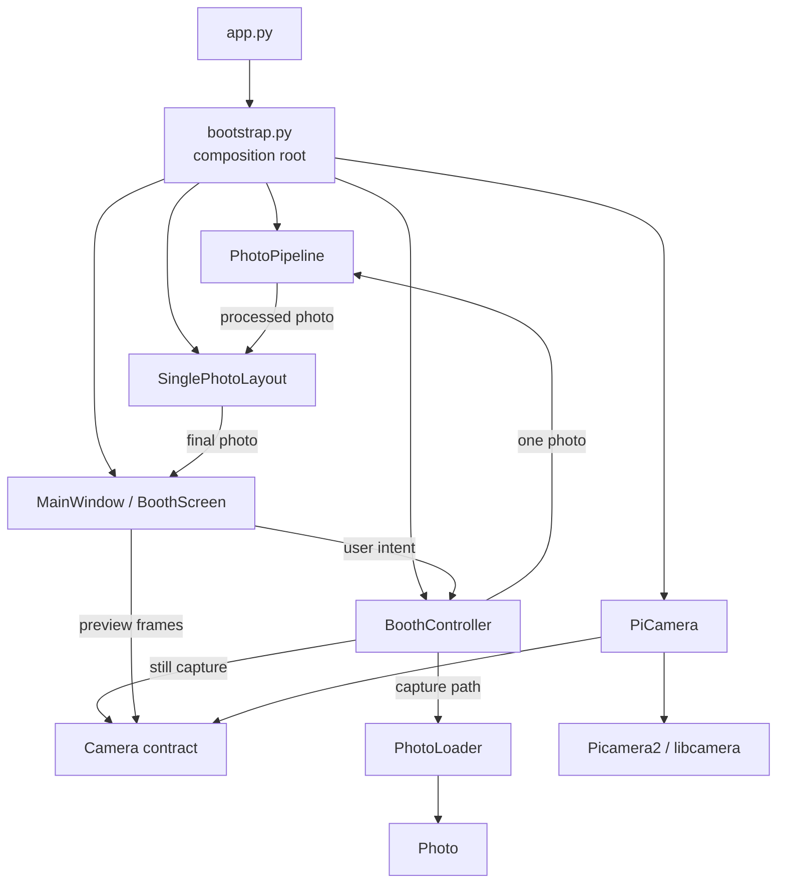
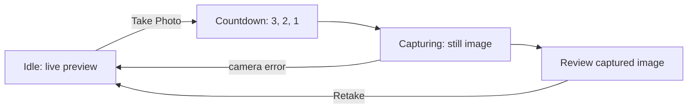

# Architecture overview

## Purpose

PiPrints is a Raspberry Pi-first photo booth platform. Its current design
prioritizes high cohesion, low coupling, dependency inversion, composition over
inheritance, testability, and hardware isolation. The codebase grows in small
milestones so new hardware and workflow capabilities can be added without
turning the application into a hardware-specific UI.

## Current implementation

The alpha implements application startup, a basic booth workflow, Raspberry Pi
camera control, composable imaging, and a PySide6 interface. `app.py` starts
the application and owns process-level camera cleanup. `bootstrap.py` is the
composition root: it creates `PiCamera`, `PhotoPipeline`, `SinglePhotoLayout`,
`BoothController`, and `MainWindow`, then injects the dependencies they need.

`BoothController` owns the workflow state (`IDLE`, `COUNTDOWN`, `CAPTURING`,
and `REVIEW`) and requests still captures through the `Camera` contract. It
coordinates imaging collaborators without decoding or transforming pixels.
`PiCamera` adapts Picamera2 and libcamera behind that contract. It configures
continuous autofocus for Camera Module 3, supplies standard `PreviewFrame`
values for live preview, and switches to a still configuration for capture.

The UI uses PySide6. `BoothScreen` renders the countdown, review, and retake
controls. `CameraPreviewWidget` obtains `PreviewFrame` values on a worker
thread, retains only the latest frame, and paints it from a Qt timer. The still
capture is also performed by a short-lived Qt worker so the UI thread remains
responsive.



The UI depends directly on the PiPrints-owned camera contract only for preview
frames. Workflow commands travel through `BoothController`; neither path gives
the UI a Picamera2 or libcamera object. A focused UI presentation adapter turns
the final imaging `Photo` into a Qt pixmap; it does not perform image
processing.

## Imaging pipeline and layouts

The imaging subsystem separates two distinct operations:

- `PhotoPipeline` applies an ordered sequence of `PhotoOperation` objects to
  exactly one in-memory `Photo`. The current `ResizeOperation` uses Pillow's
  high-quality Lanczos resampling. Pillow is a maintained dependency with
  Raspberry Pi ARM64-compatible Linux packages and provides the small,
  well-supported image API needed for this milestone.
- A `Layout` is a Strategy that receives processed photos and returns one final
  `Photo`. `SinglePhotoLayout` is the current concrete strategy and returns
  its one input unchanged.

`PhotoLoader`, also owned by `imaging`, is the narrow boundary between the
current path-based camera contract and the in-memory `Photo` model. It decodes
and copies captures to RGB before processing. `Photo` itself only wraps the
in-memory Pillow image; it has no capture-path or persistence responsibility.

Every layout declares `required_photos`. The current single-photo layout
declares `1`; a future `FourPhotoLayout` can declare `4`, letting the booth
workflow determine capture count from the selected strategy instead of adding
layout-specific branching. The current workflow intentionally remains a
single-capture flow.

## Current capture workflow



The preview worker stops before the still capture begins. Picamera2 restores
the preview configuration after the still capture, and the preview worker is
started again when the user selects **Retake**. Captures currently go to the
runtime `captures/` directory; this is not a storage or session subsystem.

## Package responsibilities

| Package | Current responsibility |
| --- | --- |
| `booth` | Implemented: basic capture state and camera coordination. |
| `camera` | Implemented: `Camera` contract, `PreviewFrame`, domain errors, and Picamera2 adapter. |
| `config` | Placeholder for future runtime configuration. |
| `imaging` | Implemented: in-memory `Photo`, path loader, per-photo pipeline and resize operation, layout contracts, and `SinglePhotoLayout`. It is independent of UI, camera hardware, storage, and printing. |
| `input` | Placeholder for future user and hardware input integration. |
| `printing` | Placeholder for future printer abstractions and implementations. |
| `session` | Placeholder for future session lifecycle behavior. |
| `storage` | Placeholder for persistent captured-photo storage; not used by current runtime captures. |
| `themes` | Placeholder for future UI theming. |
| `ui` | Implemented: PySide6 preview, booth screen, and top-level window. |
| `utils` | Placeholder; no shared utility behavior is implemented yet. |

## Dependency rules

- UI code must not import Picamera2 or libcamera.
- Picamera2/libcamera behavior belongs in `piprints.camera`.
- Booth logic must not know PySide6 widget details.
- `bootstrap.py` may depend on concrete implementations because it is the
  composition root.
- Business rules should use PiPrints-owned abstractions where practical.
- Default CI must not require Raspberry Pi hardware.

Allowed:

```text
BoothController → Camera
BoothController → PhotoLoader + PhotoPipeline + Layout
CameraPreviewWidget → Camera / PreviewFrame
bootstrap.py → PiCamera + BoothController + MainWindow
```

Discouraged:

```text
BoothScreen → Picamera2
BoothController → QWidget
Camera adapter → BoothScreen
PhotoPipeline → Layout
```

## Test boundaries

`tests/unit/` covers hardware-independent package, booth, and camera-adapter
behavior using fakes. `tests/integration/` covers PySide6 widgets and bootstrap
wiring with Qt's offscreen platform. Physical camera checks remain manual and
are excluded from standard CI.

## Future evolution

Printing, persistent storage, multi-photo layouts, themes, input hardware,
sharing, and video are not implemented. When those milestones begin, they
should be added at the package boundaries above rather than folded into the
current booth or UI classes.

## Design decisions

The reasoning behind established architectural choices is recorded in the
[architecture decision records](decisions/README.md).
