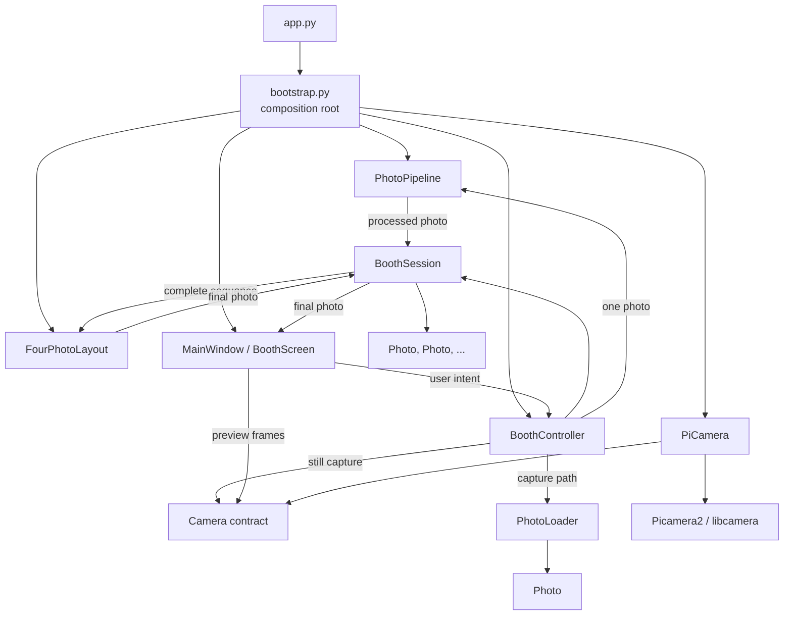
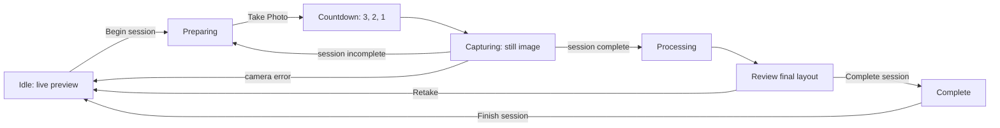
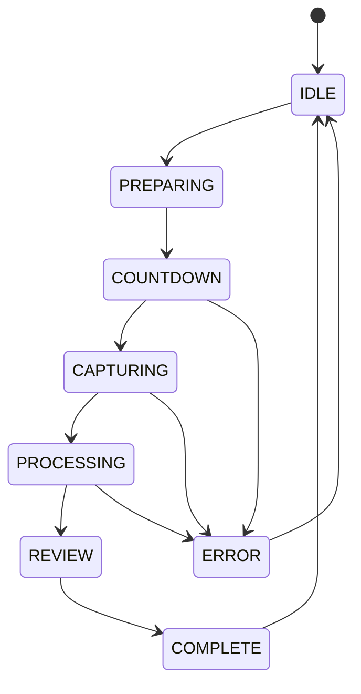

# Architecture overview

## Purpose

PiPrints is a Raspberry Pi-first photo booth platform. Its current design
prioritizes high cohesion, low coupling, dependency inversion, composition over
inheritance, testability, and hardware isolation. The codebase grows in small
milestones so new hardware and workflow capabilities can be added without
turning the application into a hardware-specific UI.

## Current implementation

The alpha implements application startup, a multi-photo booth workflow,
Raspberry Pi camera control, composable imaging, and a PySide6 interface. `app.py` starts
the application and owns process-level camera cleanup. `bootstrap.py` is the
composition root: it creates `PiCamera`, `PhotoPipeline`, `FourPhotoLayout`,
`BoothController`, and `MainWindow`, then injects the dependencies they need.

`BoothController` owns lifecycle transitions; `BoothState` represents the
current lifecycle state. The controller also owns one active `BoothSession`,
created with the selected layout's `required_photos`. It adds each processed
capture, composes only after the session is complete, and coordinates imaging
collaborators without decoding or transforming pixels.

`BoothSession` is the booth-layer record for one interaction's identity,
layout-derived capture requirement, and image artifacts. It holds ordered
captured `Photo` values and, once composed, one final `Photo`; it has no
hardware, UI, layout, or persistence behavior.
`PiCamera` adapts Picamera2 and libcamera behind that contract. It configures
continuous autofocus for Camera Module 3, supplies standard `PreviewFrame`
values for live preview, and switches to a still configuration for capture.

The UI uses PySide6. `BoothScreen` renders the countdown, review, and retake
controls. `CameraPreviewWidget` obtains `PreviewFrame` values on a worker
thread, retains only the latest frame, and paints it from a Qt timer. The still
capture is also performed by a short-lived Qt worker so the UI thread remains
responsive.



The UI depends directly on the PiPrints-owned camera contract only for preview
frames. Workflow commands travel through `BoothController`; neither path gives
the UI a Picamera2 or libcamera object. A focused UI presentation adapter turns
the final imaging `Photo` into a Qt pixmap; it does not perform image
processing.

## Imaging pipeline and layouts

The imaging subsystem separates two distinct operations:

- `PhotoPipeline` applies an ordered sequence of `PhotoOperation` objects to
  exactly one in-memory `Photo`. The current `ResizeOperation` uses Pillow's
  high-quality Lanczos resampling. Pillow is a maintained dependency with
  Raspberry Pi ARM64-compatible Linux packages and provides the small,
  well-supported image API needed for this milestone.
- `CenterCropAspectRatioStrategy` makes a pixel-independent framing decision:
  given source dimensions and an `AspectRatio`, it returns the largest centered
  `CropBox` that matches the ratio using whole integer ratio units. If a source
  has an odd remainder, the extra pixel stays on the right or bottom edge.
  `CropOperation` applies that explicit box, then `ResizeOperation` scales the
  result. This order discards unwanted pixels before scaling and is assembled
  by callers as normal pipeline operations; `PhotoPipeline` has no framing
  knowledge.
- A `Layout` is a Strategy that receives processed photos and returns one final
  `Photo`. `SinglePhotoLayout` returns its one input unchanged.
  `FourPhotoLayout` arranges four photos in a 2×2 grid, and
  `ClassicPhotoStripLayout` stacks four photos vertically. Both own their
  canvas geometry and use the same imaging crop/resize primitives to fill each
  cell. They have no camera or Qt dependency.

`PhotoLoader`, also owned by `imaging`, is the narrow boundary between the
current path-based camera contract and the in-memory `Photo` model. It decodes
and copies captures to RGB before processing. `Photo` itself only wraps the
in-memory Pillow image; it has no capture-path or persistence responsibility.

Every layout declares `required_photos`. `BoothController` passes that value to
`BoothSession`, so selecting a layout changes the session target without
layout-specific workflow branches. The session exposes an immutable photo
snapshot, count, remaining count, and completion state; it does not own camera
access, timing, layout composition, or persistence.

The UI uses the final `Photo` from the selected layout for review and Qt's
normal pixmap scaling for presentation. It does not calculate a separate
preview layout or manipulate Pillow images. This makes the preview an exact
presentation of the final composition and avoids composition work until a
session completes.

## Current capture workflow



`Countdown` is a framework-independent booth service. It yields configured
countdown ticks through an injected delay callable, so unit tests can use a
no-op delay while the runtime uses normal wall-clock sleep. `BoothController`
owns countdown execution and transitions from `COUNTDOWN` to `CAPTURING` once
the ticks complete. `BoothScreen` runs that blocking application work on a Qt
worker and renders its ticks; it does not own timing or decide the lifecycle
transition. The screen renders `Photo n of N` from `BoothSession` instead of
keeping a second progress counter.

The preview worker stops before the still capture begins. Picamera2 restores
the preview configuration after the still capture, and the preview worker is
started again when the user selects **Retake**. Captures currently go to the
runtime `captures/` directory; this is not a storage or session subsystem.

## Booth lifecycle states

`BoothState` is the booth layer's framework-independent lifecycle vocabulary.
It is a small enum, not a class-per-state State pattern.



`BoothController` owns the allowed lifecycle transitions, while `BoothState`
represents the current lifecycle state. This increment implements session
creation (`IDLE → PREPARING`), capture and processing transitions, review,
completion/reset, failure cleanup, and framework-independent countdown
execution. UI observation remains separate. The enum has no dependency on Qt,
hardware, imaging, printing, or persistence.

## Package responsibilities

| Package | Current responsibility |
| --- | --- |
| `booth` | Implemented: lifecycle transitions, session artifacts and progress, countdown progression, camera coordination, and final-session composition orchestration. |
| `camera` | Implemented: `Camera` contract, `PreviewFrame`, domain errors, and Picamera2 adapter. |
| `config` | Placeholder for future runtime configuration. |
| `imaging` | Implemented: in-memory `Photo`, path loader, per-photo pipeline, deterministic framing and crop/resize operations, layout contracts, and single/grid/strip layouts. It is independent of UI, camera hardware, storage, and printing. |
| `input` | Placeholder for future user and hardware input integration. |
| `printing` | Placeholder for future printer abstractions and implementations. |
| `storage` | Placeholder for persistent captured-photo storage; not used by current runtime captures. |
| `themes` | Placeholder for future UI theming. |
| `ui` | Implemented: PySide6 preview, booth screen, and top-level window. |
| `utils` | Placeholder; no shared utility behavior is implemented yet. |

## Dependency rules

- UI code must not import Picamera2 or libcamera.
- Picamera2/libcamera behavior belongs in `piprints.camera`.
- Booth logic must not know PySide6 widget details.
- `bootstrap.py` may depend on concrete implementations because it is the
  composition root.
- Business rules should use PiPrints-owned abstractions where practical.
- Default CI must not require Raspberry Pi hardware.

Allowed:

```text
BoothController → Camera
BoothController → BoothSession + PhotoLoader + PhotoPipeline + Layout
CameraPreviewWidget → Camera / PreviewFrame
bootstrap.py → PiCamera + BoothController + MainWindow
```

Discouraged:

```text
BoothScreen → Picamera2
BoothController → QWidget
Camera adapter → BoothScreen
PhotoPipeline → Layout
```

## Test boundaries

`tests/unit/` covers hardware-independent package, booth, and camera-adapter
behavior using fakes. `tests/integration/` covers PySide6 widgets and bootstrap
wiring with Qt's offscreen platform. Physical camera checks remain manual and
are excluded from standard CI.

## Future evolution

Printing, persistent storage, themes, input hardware, sharing, and video are
not implemented. Runtime framing targets and output
dimensions will be introduced through configuration rather than hard-coded in
the imaging pipeline. When those milestones begin, they should be added at the
package boundaries above rather than folded into the current booth or UI
classes.

## Design decisions

The reasoning behind established architectural choices is recorded in the
[architecture decision records](decisions/README.md).
